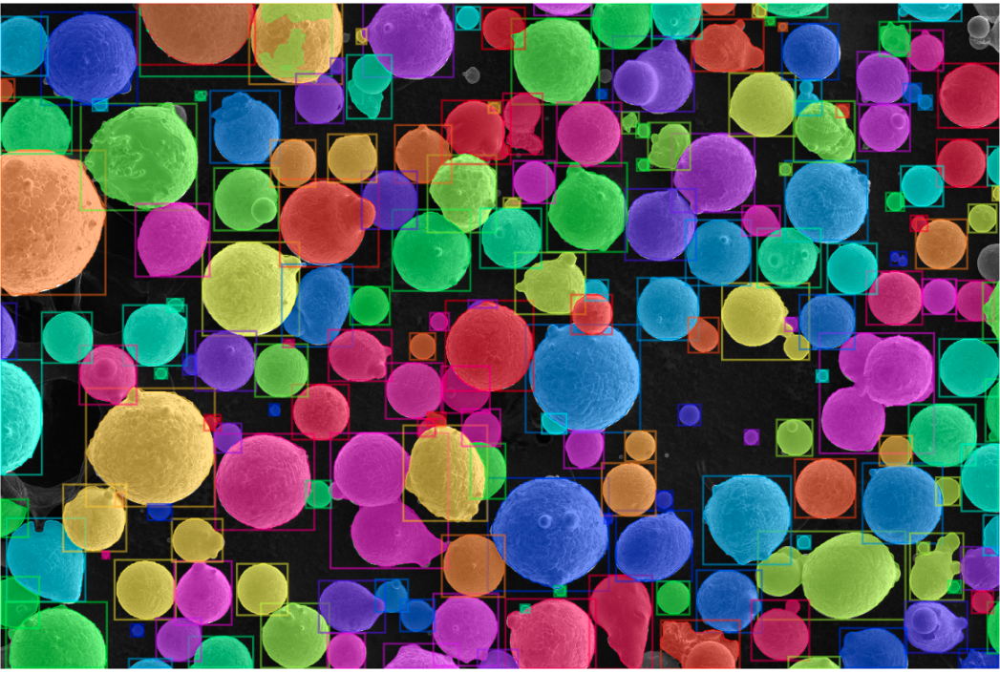

# AMPIS
Automated Materials Particle Instance Segmentation (AMPIS) utilizing Mask R-CNN.
(previously Additive Manufacturing Powder Instance Segmentation, but we expanded the study to include other materials!)



The goal of AMPIS is to make instance segmentation more accessible to materials scientists. Instance segmentation is a powerful technique that allows class labels, bounding boxes, and individual segmentation masks to be generated for every instance of every object that is detected in an image. This technique has the potential to automate the quantitative analysis of visual data in materials science much faster than manual analysis, and with higher performance and consistency.

AMPIS started as an effort to segment individual powder particles and satellites in images of powder feedstocks for additive manufacturing applications. However, the technique is very flexible. It was found to be easy to adapt to other potential useful applications such as segmenting microconstituents in steel samples, with very few changes to the code. With many unexplored applications, we wanted to open source the code for anyone interested in this technique for automated image analysis.

AMPIS wraps some of the basic functionality of [detectron2](https://github.com/facebookresearch/detectron2) to make it easier to use for people who are not as experienced with deep learning and pytorch. Additionally, AMPIS provides some additional tools that are specific to materials applications.
  

# Installation
AMPIS depends on several packages including pytorch and detectron2. These packages must be installed before installing AMPIS.
See INSTALL.md for installation instructions.

# Getting Started
new: AMPIS demo is available on [Google Colab](https://colab.research.google.com/drive/1bldlHa3-6_GL-C3sOF2B8qsCPBz2iBUR?usp=sharing). For most people, this will be the easiest and fastest way of getting up and running.

AMPIS provides a couple examples in the form of jupyter notebooks which demonstrate the process of setting up, training, and evaluating instance segmentation models. 
The documents (see docs/ampis_Documentation.pdf, online documents coming soon!) also contains a comprehensive list of the api.
See GETTING_STARTED.md for more details.

# Acknowledgements

This work was supported by the National Science Foundation under grant CMMI-1826218 and by the Air Force Research Laboratory under cooperative agreement number FA8650-19-2-5209.

# Citing this work
If you use AMPIS, please cite our paper: <https://doi.org/10.1007/s11837-021-04713-y>. 
```
@article{Cohn2021,
   author = {Ryan Cohn and Iver Anderson and Tim Prost and Jordan Tiarks and Emma White and Elizabeth Holm},
   doi = {10.1007/S11837-021-04713-Y/FIGURES/10},
   issue = {7},
   journal = {JOM},
   month = {7},
   pages = {2159-2172},
   publisher = {Springer},
   title = {Instance Segmentation for Direct Measurements of Satellites in Metal Powders and Automated Microstructural Characterization from Image Data},
   volume = {73},
   url = {https://link.springer.com/article/10.1007/s11837-021-04713-y},
   doi = {10.1007/S11837-021-04713-Y/FIGURES/10},
   year = {2021},
}

```
Copyright (c) 2020 Ryan Cohn and Elizabeth Holm. All rights reserved. \
Licensed under the MIT License (see LICENSE for details)
